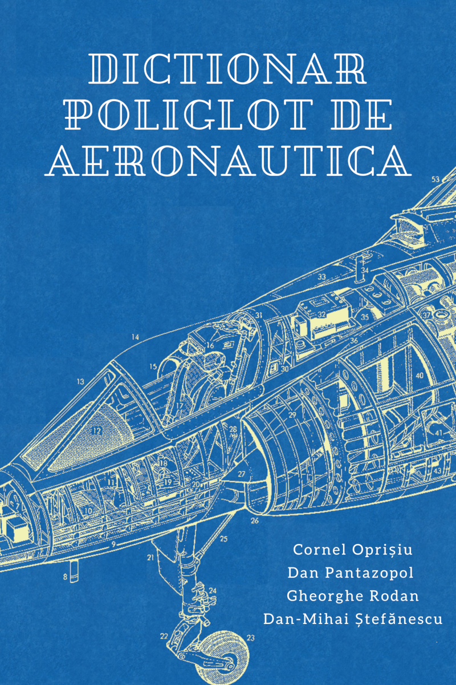

## Dicționar poliglot de aeronautică

With great sadness I found out today that two of my late father's friends and co-authors of this unpublished book have passed away. I hope that sharing this otherwise lost body of work helps future aeronautical engineers not only find answers in their field of work but also makes them feel that decade long heart-felt friendships are the genesis of nice projects. just like this book here.

## IN MEMORIAM

Gheorghe Rodan

Cornel Șerban Oprișiu

Dan Pantazopol

### contents

in the [release](https://github.com/rodan/dictionar_poliglot_de_aeronautica/releases/) section you can find the dictionary in dict, stardict and mobi formats. this allows the use of third-party software to perform queries in any of the 6 languages: english, romanian, french, italian, spanish and german.

the 'dict' format can be used with the dictionary database server, called dictd. details can be found here: https://directory.fsf.org/wiki/Dictd

the 'stardict' format can be used directly with desktop and phone applications. see http://www.huzheng.org/stardict/ and https://f-droid.org/packages/com.annie.dictionary.fork/ for android

the 'mobi' format can be used by kindle e-readers. see https://calibre-ebook.com/ for a way to upload the files to the device.

the 'dpa' project is a small console-based tool that performs full text search and provides the translations in the selected languages.

if this repository has helped you, please consider a donation to an Alzheimer's Research Association of your choosing.

